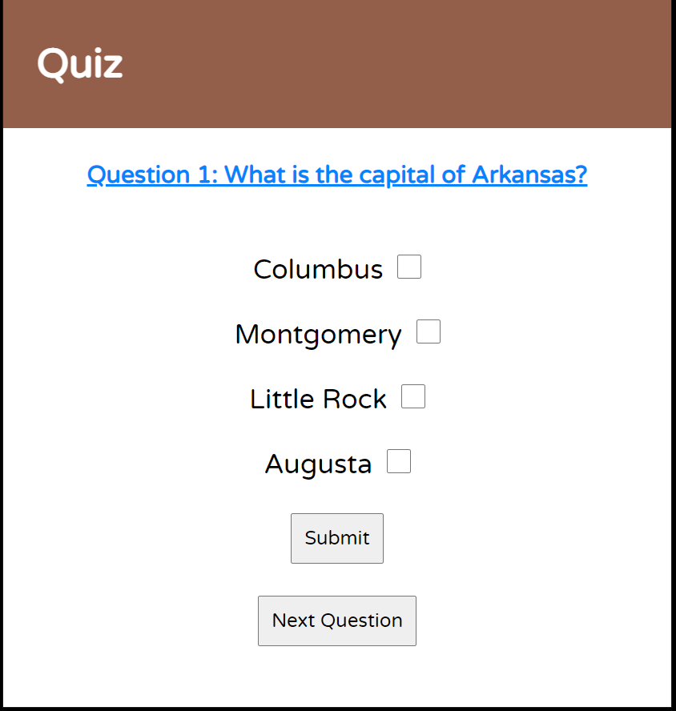
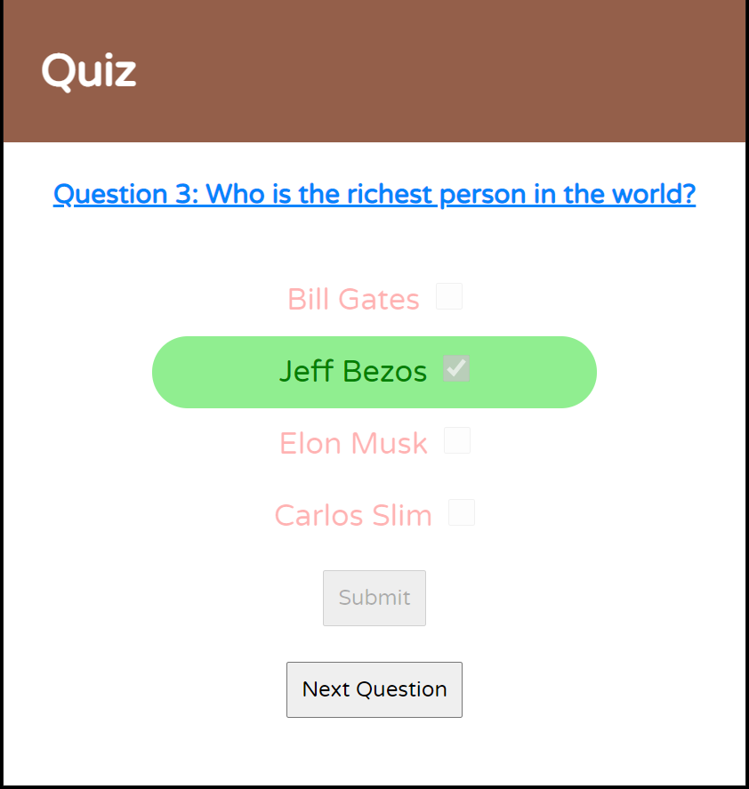

# Quiz
A multiple-choice 5 question quiz implemented and created with HTML, CSS, and JS

 

# Screenshots

 

# Technologies Used & Features
**Implemented using:** 
* HTML
* CSS
* JavaScript

 

**Features:** 
* Start page to initialize the quiz
* 5 pages with a different question on each page
* Multiple choice answers
* 'Submit' and 'Next Question' buttons
* Highlights answer in green if correct
* Red line-through answer in red if wrong
* Submit button and checkboxes become disabled after submitting
